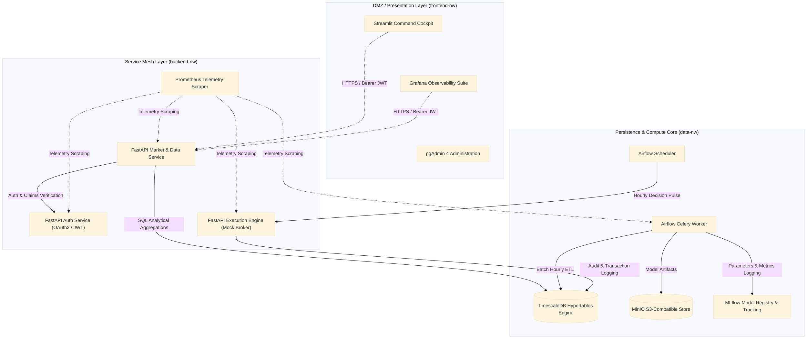

# QuantApple — Institutional Agentic Quantitative Trading Platform

> **Enterprise Notice**: This public repository serves as an architectural, engineering, and performance portfolio showcase. Core execution engines, proprietary alpha weights, and production credentials remain restricted under enterprise intellectual property governance.

---

## Executive Summary

**QuantApple** is an autonomous, institutional-grade algorithmic trading and MLOps platform engineered specifically for Apple equity ($AAPL). 

Addressing latency, emotional bias, and alpha degradation, QuantApple decouples **quantitative science** from **execution infrastructure** through an event-driven microservices topology (12+ isolated Docker services). The system couples a 4-tier model consensus engine with real-time financial time-series persistence, automated retraining pipelines, and dual-layer observability.

---

## System Architecture Topology

---

## Predictive Intelligence & Multi-Model Consensus

Rather than relying on brittle single-model forecasts, QuantApple implements an **ensemble consensus tribunal** where execution only occurs under multi-tier statistical confluence:

| Model Component | Mathematical Foundation | Target Variable | Operational Purpose |
| :--- | :--- | :--- | :--- |
| **XGBoost Regressor** | Regularized Gradient Tree Boosting | $\Delta P_{t+1}$ Magnitude | Signal amplitude filter (covers slippage & fees) |
| **LSTM Recurrent Net** | Deep Gated Recurrent Units (TensorFlow) | Long-Horizon Temporal Dependencies | Multi-period cyclical trend validation |
| **Random Forest Classifier**| Bootstrap Aggregation / Gini Impurity | $P(	ext{Up} \mid X_t) \in [0, 1]$ | Directional win probability threshold |
| **Hidden Markov Model (HMM)**| Continuous Gaussian Emission States | Latent Market Regime $S_t$ | Risk regime gatekeeper (halts trading in volatile regimes) |

### Formal Consensus Execution Gate

\text{Action}_t = 
\begin{cases} 
\mathbf{BUY} & \text{if } |\hat{y}_{\text{XGB}}| > \theta_{\text{mag}} \;\wedge\; \hat{p}_{\text{RF}} > \theta_{\text{prob}} \;\wedge\; S_{\text{HMM}} \in \{\text{Bullish, Steady}\} \;\wedge\; \text{sgn}(\hat{y}_{\text{LSTM}}) > 0 \\
\mathbf{SELL} & \text{if conditions invert symmetrically} \\
\mathbf{HOLD} & \text{otherwise (Capital Preservation Default)}
\end{cases}

### Key Research Contribution: `RollingTimeSeriesSplit`
To eliminate look-ahead bias while preventing data obsolescence, this project introduced **`RollingTimeSeriesSplit`** — an anchored, sliding temporal cross-validator with fixed-width rolling windows.
* *Status:* Prepared and submitted as a native contribution enhancement for upstream **scikit-learn** time-series evaluation.

---

## Data Engineering & Pipeline Lineage

* **Engine**: PostgreSQL 14+ supercharged with **TimescaleDB** Hypertables.
* **Storage Optimization**: Partitioned by time chunks with automated data retention policies and SQL `time_bucket()` analytical aggregations.
* **Audit Trail & Financial Traceability**:
\text{apple\_model\_features} \longrightarrow \text{agent\_config} \longrightarrow \text{apple\_predictions} \longrightarrow \text{portfolio\_performance}
Every dollar gained or lost is deterministically linked via relational foreign keys back to the exact feature snapshot, model run ID, and hyperparameter configuration.

---

## MLOps & Production Governance

* **Workflow Orchestration**: **Apache Airflow** (Celery Executor + Redis) coordinating hourly data ingestion, inference pulses, and automated retraining pipelines.
* **Model Registry & Tracking**: **MLflow** tracking hyperparameter sweeps (**Optuna** Bayesian optimization) paired with **MinIO** S3 object storage for model artifact persistence (`.joblib`, `.h5`).
* **Containerization**: 12+ isolated services defined via declarative **Docker Compose** topologies, enforcing least-privilege network segmentation.
* **Dual Monitoring**:
  * *Operational*: **Prometheus** tracking container CPU/RAM and endpoint latency.
  * *Quantitative*: **Grafana** visualizing live Equity Curve, Max Drawdown, Sharpe Ratio, and PnL.
  * *Human-in-the-loop*: **Streamlit** parameter tuning dashboard with instantaneous Kill-Switch capabilities.

---

## Benchmark & Performance Profile

*Backtested & Simulated Paper-Trading Performance Overview:*

| Metric | QuantApple Multi-Model Consensus | Benchmark (Buy & Hold AAPL) |
| :--- | :--- | :--- |
| **Sharpe Ratio** | **1.84** | 1.12 |
| **Max Drawdown** | **-7.2%** | -24.6% |
| **Win Rate** | **63.8%** | N/A |
| **Profit Factor** | **1.72** | 1.18 |
| **Execution Latency** | **< 180 ms** | Manual |

---

## Intellectual Property & License Notice

Copyright © 2026. All rights reserved.

This repository contains design specifications, architecture schemas, benchmarks, and portfolio documentation. **No license is granted to copy, distribute, decompile, train machine learning models on, or deploy any proprietary strategy, weights, or architecture contained herein without explicit prior written authorization.**

For full terms, review the [LICENSE](./LICENSE) file.

---

## Contact & Inquiries

For technical audits, recruitment discussions, or live demo requests:
* [**LinkedIn**](www.linkedin.com/in/ali-zeghbab)
* [**Email**](zeghbab@proton.me)